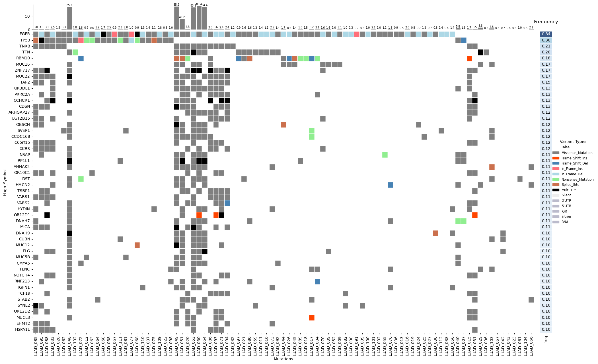

# pymaftools

`pymaftools` is a Python package designed to handle and analyze MAF (Mutation Annotation Format) files. It provides utilities for working with mutation data, including the `MAF` and `PivotTable` classes for data manipulation, and functions for visualizing mutation data with oncoplots.

## Features

- **MAF Class**: A utility to load, parse, and manipulate MAF files.
- **PivotTable Class**: A custom pivot table implementation for summarizing mutation frequencies and sorting genes and samples.
- **Oncoplot Visualization**: Generate oncoplot visualizations with mutation data and frequencies.

## Installation

### Using pip (from PyPI)
You can install the `pymaftools` package directly from PyPI using pip:

```bash
pip install pymaftools
```

### Using GitHub (for the latest version)
To install directly from GitHub (if you want the latest changes):

```bash
pip install git+https://github.com/xu62u4u6/pymaftools.git
```


## Usage

### Importing the Package

```python
from pymaftools.maf_utils import MAF, PivotTable
from pymaftools.maf_plots import create_oncoplot
```

### Getting start

```python
# Load MAF files
maf_case1 = MAF.read_maf("case1.maf")
maf_case2 = MAF.read_maf("case2.maf")
all_case_maf = MAF.merge_mafs([maf_case1, maf_case2])

# Filter to keep only nonsynonymous mutations
filtered_all_case_maf = all_case_maf.filter_maf(MAF.nonsynonymous_types)

# Convert to pivot table (genes x samples table, mutation classification as values)
pivot_table = filtered_all_case_maf.to_pivot_table()

# Calculate mutation frequencies
pivot_table = pivot_table.add_freq()

# Sort the pivot table (by gene frequency and sample mutation count)
sorted_pivot_table = (pivot_table
                       .sort_genes_by_freq()  
                       .sort_samples_by_mutations()
                    )

# Generate an oncoplot to show the top 50 genes with the highest mutation frequencies
create_oncoplot(sorted_pivot_table.head(50), 
                figsize=(26, 15),
                ax_main_range=(0, 28), 
                ax_freq_range=(28, 29), 
                ax_legend_range=(29, 31),
                mutation_counts=True)

```


### Requirements
Python 3.x
pandas, numpy, matplotlib, seaborn

### License
This project is licensed under the MIT License - see the LICENSE file for details.

### Author
xu62u4u6

